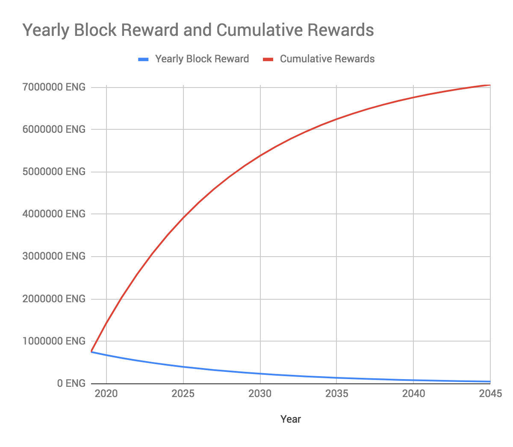

# FAQ

## How does enigma use Ethereum?
Ethereums blockchain used as a verification layer. Each private computation records a hash on the blockchain. The hash merely verifies that the computation executed successfully without anyone interfering.

## What is the minimum ENG stake required for Enigma?
The minimum ENG stake required for a mainnet secret node is *25,000 ENG*. This number was selected based on our study of many other networks, internal modeling based on the current distribution of ENG, and balancing our desire for decentralization with network sustainability and having meaningful stakes for node operators. This minimum threshold will however be reduced over the life of the network.

## What will block rewards and network fees look like on Enigma?

In return for operating a secret node and staking on Enigma, node operators receive a share of fees paid on the network as well as block rewards. Block rewards for the Enigma network will begin at 750,000 ENG for the first year the mainnet is in operation and decrease 10% year-over-year thereafter. The total block rewards pool is thus 7.5M ENG and will not be exhausted for the first century the network is in operation. This pool is 1/5th of the total token pool reserved for network, community, and ecosystem incentives (37.5M ENG). Block rewards on the Enigma network, by year and cumulative. Please keep in mind that the total supply of ENG is fixed at 150M ENG, with 75M ENG already in circulation since 2017 and the vast majority of the remainder not expected to enter circulation within the next few years. We visualize this below:

## What (and why) is a genesis node?

In the early “bootstrapping” stages of a network, it is important to grow in a decentralized, but still manageable way. Early days of the Enigma network will require hard forks and changes, and being able to effectively coordinate and communicate will be critical. We reiterate: this is in the service of creating a robust, sustainable network that becomes and remains more decentralized, useful, and valuable over the long term. And like any mission to where no one has gone before, a secure and successful launch is the most critical part.
Therefore, the number of secret nodes available when Discovery is deployed on mainnet will be limited to 50 “genesis nodes”— a number that based on our research and modeling meaningfully decentralizes the network while maintaining its early stability. Below we will outline how genesis nodes are selected and how (and when) this limit can and will be lifted.

## How are genesis nodes selected?

Nodes active during Discovery’s testnet phase will be assigned a weighted score calculated based on their total (testnet) ENG staked and their uptime during this period. This “genesis score” is projected to be calculated based on the following formula:
    - sqrt (avg_staked_amount) * number_of_days_staked * percentage_uptime
Anyone can participate in the Genesis Game during the testnet staking period. The “game” itself is projected to last eight weeks. At the conclusion of this phase, genesis nodes will be selected as follows:
* The top 30 nodes by genesis score are selected as genesis nodes.
* More nodes (up to 10 maximum) will be eligible for whitelisting based on contributions to the Enigma ecosystem, primarily those building supply-side tooling for workers and staking operations.
* Dependent on the size of this whitelist, 10–20 more nodes are chosen based on a lottery system, with weighting in the lottery determined by your genesis score. This means that even if you do not finish in the top 30 by genesis score, you are still eligible for random selection as a genesis node. This will help encourage broader participation in testing the Discovery network.

As mentioned, there will be 50 genesis secret nodes in total when mainnet launches. These nodes will be the only nodes eligible to operate when Discovery launches, and they alone will receive block rewards and network fees until more nodes are added to the network. (In a later section, there are details on how and when secret nodes beyond genesis nodes will be added.)

<!-- ## I want to run a genesis node. What happens now? -->

## How will nodes increase over time?

*After a future anticipated hard fork, any node that meets the minimum staking requirement and hardware requirements will be allowed to join the network.* By limiting the network to genesis nodes until after the hard fork occurs, Enigma provides an exclusive period for genesis node operators who supported the network during its testnet phase while helping to ensure there are no disruptions from an early fork. But by then opening up the network to all participants, we preserve the permissionless nature of Enigma and expand the network rapidly once its operations have been secured. This also keeps things relatively simple: no more complex games or competitions, no new requirements.
Enigma does not have a date for this hard fork at this time, as again there are too many unknowns.

## How are nodes selected for computations?

As mentioned by enigma in previous posts, nodes are selected for computations based on their ENG stake. To keep things simplistic for the purposes of this post: the more ENG that is staked by a node, the greater the node’s chance of selection. There is no maximum stake for a single node, but again, the minimum stake is 25,000 ENG.

## Will there be stake slashing in Discovery?

This has been a common question in our community from node operators concerned about losing their stake in the early stages of the network due to losing their connections, for example. The answer is simple: *no, there will not be stake slashing when Discovery launches.*

## What are hardware and software requirements?

Specialized hardware requirements for Discovery are not substantial. However, running a secret node will require access to an SGX-enabled computer or an SGX-enabled cloud operator. Any 6th Generation Intel Processor (Skylake) after Q3 of 2015 should have this capability. However, this may or may not be enabled by the BIOS — for example, SGX in Mac computers is not and cannot be enabled. Currently IBM and Alibaba Cloud do enable SGX instances. For a detailed list of SGX enabled hardware and cloud options, please visit this [link](https://github.com/ayeks/SGX-hardware). Additionally, enigma will require the use of Linux as an operating system as Windows is not expected to be supported in Discovery.