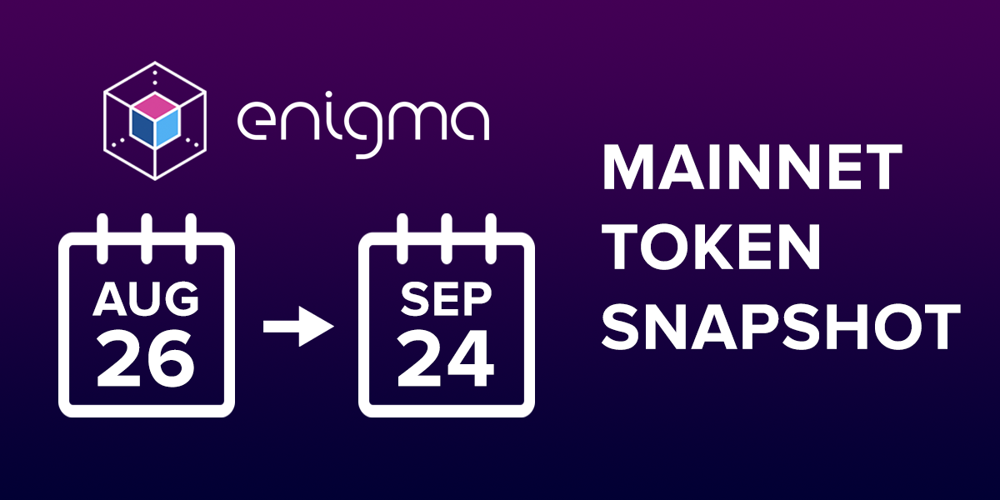

# Genesis Games Overview

# When is the ENG snapshot?
The snapshot window will begin on August 26th, 2019. The final day of the window is September 24th, 2019.

# ENG Snapshot

*The number of secret nodes available when Discovery is deployed on mainnet will be limited to 50 “genesis nodes”.* For the purposes of decentralizing Enigma, genesis nodes must be selected in as fair and permissionless a manner as possible. Our solution to this was to allow node operators to begin running secret nodes during the testnet phase of Enigma, then selecting the best-performing nodes during this period (as measured primarily by uptime, but also by stake) to become genesis nodes. *This selection process is being called the “Genesis Game”.*

To run a node on testnet, you will need to stake testnet ENG tokens. Again, in the interest of fairness, testnet ENG tokens will be distributed based on your mainnet ENG holdings. Here are some important details, some of which are new, based on our current plans:

* You will need to hold your ENG in an address that you control. That means if you are currently holding mainnet ENG tokens on an exchange and plan to run a testnet node, you will need to withdraw these tokens in order to receive your testnet ENG. If you hold your tokens in MEW, MyCrypto, or a hardware wallet, you do not need to take any action.
* We will take snapshots of mainnet ENG holdings over a 30-day window, one snapshot per day at a randomly determined hour. (This is similar to how other projects have conducted token snapshots.) We will then calculate the average holdings by address during this window — i.e. take the sum of holdings from each snapshot and divide this total by 30. Testnet tokens will then be distributed based on this average holding calculation.

> Example A: You hold 100,000 ENG in a single non-exchange mainnet address for the entire duration of the snapshot window. Your average holdings are (100,000 * 30 / 30) = 100,000 ENG, and you receive 100,000 testnet ENG.
        
> Example B: You withdraw 300,000 ENG from an exchange to a single mainnet address on the final day of the snapshot window. Your average holdings are (300,000 * 1 / 30) = 10,000 ENG, and you receive 10,000 testnet ENG.

* You must stake a minimum of 25,000 testnet ENG to operate a testnet node and compete in the Genesis Game. (This is equivalent to the minimum stake for a mainnet node.)
* If you have less than 25,000 ENG, you may be able to work with a custodial or non-custodial staking provider for testnet staking. You will have up to 4 weeks to send your testnet ENG to your preferred custodial staking service provider.
* Importantly, if you are selected to run a Genesis Node, you will need to stake an amount of mainnet ENG that is at least the average number of tokens you staked during the Genesis Game. For example: you receive 50,000 testnet ENG tokens based on your average mainnet holdings. You then stake all 50,000 testnet tokens during the Genesis Game. Based on your excellent performance, you are selected to run a Genesis Node. Based on the above, you must stake at least 50,000 tokens to operate your node on mainnet. If you are a custodial staking service provider and your staking amount changes over the Genesis game, you will be required to stake at least the daily average ENG staked.

# What’s next on the Genesis Game timeline?

Recapping from and adding to our previous post:
1. The first snapshot will occur on August 26th, 2019. The last snapshot will occur on September 24th, 2019. (Snapshots are conducted daily at a random hour.)
2. After the window closes, average holdings will be calculated as mentioned.
3. testENG tokens will be distributed based on average holdings.
4. The Discovery release of our protocol will be deployed on Ethereum testnet. This is the beginning of the “testnet period”. The Genesis Game will not begin on the day of deployment, in order to give node operators time to set up and test their nodes. We’ll have more guidance on this as we approach testnet release.
5. The Genesis Game begins and runs for a period of 4–8 weeks.
6. Genesis Nodes are selected based on their Genesis Score during the game period.